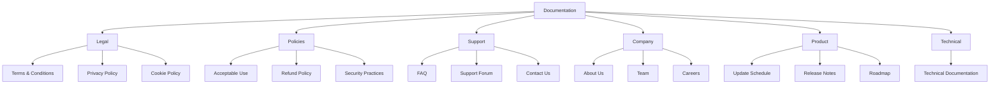

# Documentation Hub

## Browse Documentation

### Legal
- [Terms & Conditions](terms-and-conditions.mdx)
- [Privacy Policy](privacy-policy.mdx)
- [Cookie Policy](cookie-policy.mdx)

### Policies
- [Acceptable Use Policy](acceptable-use.mdx)
- [Refund Policy](refund-policy.mdx)
- [Security Practices](security-practices.mdx)

### Support
- [FAQ](faq.mdx)
- [Support Forum](support-forum.mdx)
- [Contact Us](contact-us.mdx)

### Company
- [About Us](about-us.mdx)
- [Our Team](team.mdx)
- [Careers](careers.mdx) *Coming soon*

### Product
- [Update Schedule](update-schedule.mdx)
- [Release Notes](release-notes.mdx)
- [Product Roadmap](roadmap.mdx)

### Technical
- [Technical Documentation](technical-documentation.mdx)