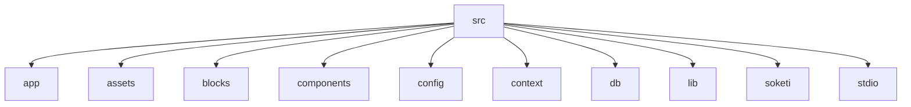

# Technical Documentation

## Project Structure
The application follows a structured organization within the `src` directory:



### Key Directories:
- **app**: Contains Next.js application routes and pages
- **components**: Reusable UI components
- **db**: Database-related code and schema definitions
- **lib**: Utility functions and helper modules
- **config**: Application configuration files

## Socket.IO Integration
The `socket.js` module handles real-time communication:

```js:src/socket.js
import { io } from "socket.io-client";

const isBrowser = typeof window !== "undefined";

export const socket = isBrowser ? io() : {};
```

### Key Features:
- Browser environment detection to avoid server-side execution
- Singleton socket instance for consistent communication
- Automatic connection management